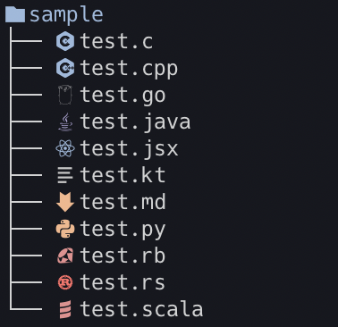

# gtree

🎄 tree command with icons.



## Requirements

[Nerd Fonts](https://www.nerdfonts.com/) or related fonts.

## Installation

```
$ go get github.com/kitagry/gtree
```

## Usage

```
$ gtree
```
